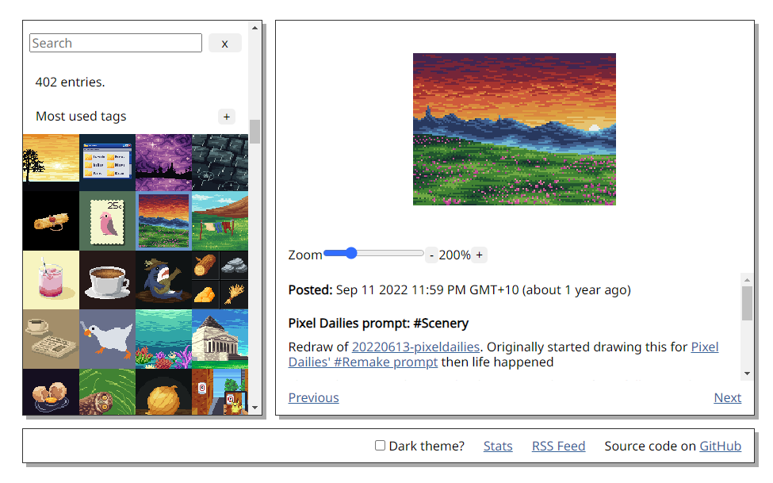

# Pixel Art Gallery

Collection of pixel arts created by me.

Hosted at https://pakkudon.github.io/pixel-art-gallery/



## Made with

Most of these pieces were created in [GIMP](https://www.gimp.org/) with a few earlier pieces created in [Lospec's Pixel Editor](https://lospec.com/pixel-editor/).

The gallery itself is built using React and React Router. CSS is also processed with [Autoprefixer](https://www.npmjs.com/package/autoprefixer) to generate vendor-specific prefixes.

## Development

### Prerequisites

- Node v10 or later
- Yarn

### Local Development

- Clone repo
- `cd` into cloned repo and run `yarn install` to install dependencies
- Run `yarn dev` to start local development server
- Visit `localhost:8080` or whichever port the above server has used to view the page

### Scripts

- `dev` - Starts local development server
- `build` - Generates bundled assets, link previews and RSS feed. Artifacts are written to `dist/`
- `deploy` - Runs `build` script and pushes generated assets to Github Pages
- `format` - Formats docs and code using [Prettier](https://prettier.io/)
- `lint` - Lints `src` directory

### Updating pixel art entries

- Add new pixel art images to `img` directory
- Add JSON entry for new image to `src/data.js`. Schema for JSON object is as follows:

```js
{
  src: "[filename minus `img/` prefix (eg: 20200101.png)]",
  description: `
    Multiline string. Accepts markdown
  `,
  date: "date formatted in YYYY-MM-DD HH:SS (eg: 2020-01-01 00:00)",
  tags: ["words", "can contain spaces"],
},
```

- Run development server to preview changes.
- Run `yarn deploy` to build assets, link previews and generate RSS feed. This script will also deploy these to Github pages

## Architecture Decisions

This project uses [Architecture Decision Records](https://adr.github.io/) to capture the rationale (or lack thereof) for architecturally significant decisions. You can find them at [doc/adr/](doc/adr/).
